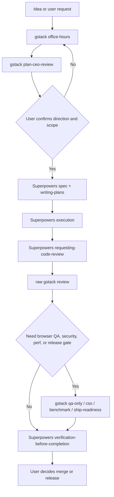
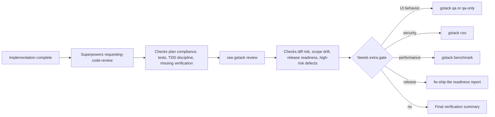
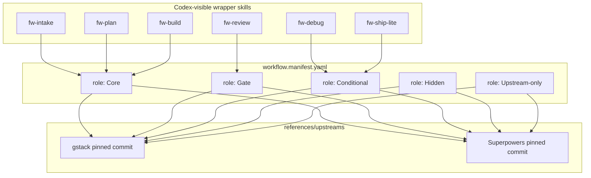
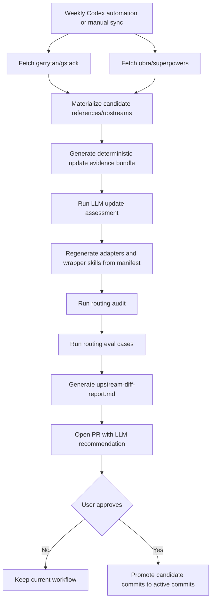

# Curated GStack + Superpowers Workflow

Generated: 2026-05-11
Status: REVISED AFTER REVIEW

## Goal

Build one curated global Codex workflow that combines gstack and Superpowers without exposing two overlapping end-to-end workflow systems to Codex routing.

The workflow must preserve the user's operating model:

- gstack owns product judgment, scope challenge, architecture review, QA, security, and release gates.
- Superpowers owns implementation discipline: plans, TDD, debugging, execution, verification, and branch finishing.
- Codex owns runtime execution, local tooling, memory, and orchestration.
- Standalone/native Codex review is not part of the review methodology. Review must use Superpowers plus raw gstack review together.

## Review Corrections Applied

The first version of this design treated upstream skills as if a wrapper could simply list them and safely inherit their behavior. That was wrong.

This revised design adds three hard requirements:

1. Wrappers execute curated adapter/reference chains; raw upstream skill files are read only when the manifest explicitly includes them.
2. Upstream source material is copied into `references/upstreams/<name>/<sha>/` before wrappers can reference it.
3. `fw-review` must combine Superpowers review discipline with raw upstream `gstack-review`. Standalone/native Codex review is still forbidden as an independent owner, but raw gstack review is allowed inside the gstack-managed gate.

## Core Flow



## Review Flow

Review is a deliberate combination of Superpowers and raw gstack review. It must not fall back to standalone/native Codex review as a separate owner.



## Skill Visibility Model

The curated workflow exposes a small wrapper surface. Upstream skills remain available as source material but are not all directly visible to Codex routing.



## Role Definitions

| Role | Meaning | Routing behavior |
|---|---|---|
| Core | A skill or adapter that is part of the default workflow path. | Wrapper may invoke the curated adapter/reference directly. |
| Gate | A skill or adapter that reviews or approves a stage but does not own execution. | Wrapper invokes it only at defined handoff points. |
| Conditional | A skill or adapter used only when a concrete condition is present. | Wrapper requires an explicit trigger, such as UI QA or security review. |
| Hidden | A raw upstream skill that should not be exposed to Codex routing in this curated workflow. | Keep it out of exported `skills/`; preserve upstream copy in references. |
| Upstream-only | A raw upstream skill retained only as source material or upstream attribution. | Not user-invoked; generator and adapter builder can read it for updates and diffs. |

## Visibility Schema

Every manifest entry must separate role from runtime visibility:

```yaml
visibility:
  exported: false
  reference_available: true
  executable_directly: false
  adapter_required: true
```

| Field | Meaning |
|---|---|
| `exported` | Whether the skill appears under the generated plugin `skills/` directory and is visible to Codex routing. |
| `reference_available` | Whether the upstream source is copied into `references/upstreams/` and may be read by adapters. |
| `executable_directly` | Whether a wrapper may instruct Codex to follow the upstream skill directly. |
| `adapter_required` | Whether the upstream content must be transformed before use. |

## Wrapper Skills

| Wrapper | Purpose | Included upstream skills |
|---|---|---|
| `fw-intake` | Clarify idea, demand, user, and scope before planning. | `gstack-office-hours`, `gstack-plan-ceo-review` |
| `fw-plan` | Convert approved direction into a Superpowers-consumable spec plus linked execution plan. | `superpowers:writing-plans`, `gstack-plan-eng-review`, `gstack-plan-design-review` |
| `fw-build` | Execute approved plans using Superpowers discipline. | `superpowers:using-git-worktrees`, `superpowers:test-driven-development`, `superpowers:executing-plans`, `superpowers:subagent-driven-development`, `superpowers:verification-before-completion` |
| `fw-debug` | Investigate bugs with Superpowers first; escalate to gstack only when conditions require it. | `superpowers:systematic-debugging`, `gstack-investigate` |
| `fw-review` | Run plan-compliance review plus final diff/risk review by combining Superpowers with raw gstack review. | `superpowers:requesting-code-review`, raw `gstack-review`, `superpowers:receiving-code-review`, conditional `gstack-qa-only`, conditional `gstack-cso`, conditional `gstack-benchmark` |
| `fw-ship-lite` | Finish branch, update docs, and produce a release-readiness report without default deploy actions. | `superpowers:finishing-a-development-branch`, `gstack-document-release`, `adapters/gstack/ship-readiness.md` |

## Superpowers Skill Matrix

| Skill | Role | Driver | Notes |
|---|---|---|---|
| `brainstorming` | Hidden | gstack | Hidden by default because `office-hours` and `plan-ceo-review` own product discovery. May be used as upstream reference for creative prompts. |
| `writing-plans` | Core | Superpowers | Main bridge from confirmed gstack direction into Superpowers spec and executable plan docs. |
| `using-git-worktrees` | Core | Superpowers | Used at execution time to isolate work when the host environment requires it. |
| `test-driven-development` | Core | Superpowers | Default implementation discipline for features and bug fixes. |
| `executing-plans` | Core | Superpowers | Inline execution path for saved plans. |
| `subagent-driven-development` | Core | Superpowers | Recommended execution path when tasks can be split and reviewed between steps. |
| `dispatching-parallel-agents` | Conditional | Superpowers | Use only when 2+ independent tasks can run without shared write scope. |
| `systematic-debugging` | Core | Superpowers | Default debug owner. |
| `requesting-code-review` | Gate | Superpowers | First review gate after implementation; checks plan compliance and verification discipline. |
| `receiving-code-review` | Gate | Superpowers | Used when review findings need validation before implementation. |
| `verification-before-completion` | Core | Superpowers | Required before claiming work is complete. |
| `finishing-a-development-branch` | Core | Superpowers | Used by `fw-ship-lite` for branch finishing before any release action. |
| `writing-skills` | Conditional | Superpowers | Use when the curated workflow itself creates or edits skills. |
| `using-superpowers` | Upstream-only | Superpowers | Reference for Superpowers operating principles; wrapper owns visible routing. |

## GStack Skill Matrix

| Skill | Role | Driver | Notes |
|---|---|---|---|
| `gstack-office-hours` | Core | gstack | First stage for ideas, problem framing, and demand reality. |
| `gstack-plan-ceo-review` | Core | gstack | Second stage for scope, ambition, and premise challenge. |
| `gstack-plan-eng-review` | Gate | gstack | Engineering gate before or during `fw-plan`, not an implementation owner. |
| `gstack-plan-design-review` | Gate | gstack | Design gate for UI or UX-affecting work. |
| `gstack-plan-devex-review` | Conditional | gstack | Use for developer-facing workflow or docs. |
| `gstack-autoplan` | Hidden | gstack | Hidden because it overlaps with the curated staged workflow. May inform future review chains. |
| `gstack-review` | Gate reference | gstack | Raw upstream review is not exported directly, but `fw-review` reads and uses it as the gstack review gate after Superpowers review request setup. |
| `gstack-qa` | Conditional | gstack | Use for browser QA with fixes allowed. |
| `gstack-qa-only` | Conditional | gstack | Use for report-only QA. |
| `gstack-cso` | Conditional | gstack | Use for security-sensitive changes. |
| `gstack-benchmark` | Conditional | gstack | Use for performance-sensitive web changes. |
| `gstack-benchmark-models` | Conditional | gstack | Use for model/skill benchmark comparisons only. |
| `gstack-canary` | Upstream-only | gstack | Excluded from v1 default runtime. May become conditional after deploy behavior is separately reviewed. |
| `gstack-document-release` | Conditional | gstack | Used by `fw-ship-lite` when shipped changes require documentation updates. |
| `gstack-ship` | Upstream-only | gstack | Excluded from v1 default runtime because it can push PR/release behavior. Use only as source material for `adapters/gstack/ship-readiness.md`. |
| `gstack-land-and-deploy` | Upstream-only | gstack | Excluded from v1 default runtime because it can perform external release actions. |
| `gstack-setup-deploy` | Conditional | gstack | Use only when deploy configuration is missing. |
| `gstack-landing-report` | Conditional | gstack | Use when release queue or workspace coordination is needed. |
| `gstack-design-consultation` | Conditional | gstack | Use for standalone design exploration, not default planning. |
| `gstack-design-shotgun` | Conditional | gstack | Use when the user asks for multiple visual design variants. |
| `gstack-design-html` | Conditional | gstack | Use after design approval for Pretext-native HTML output. |
| `gstack-design-review` | Conditional | gstack | Use for visual QA and polish. |
| `gstack-devex-review` | Conditional | gstack | Use for developer experience audits. |
| `gstack-investigate` | Conditional | Superpowers-first | Use only when Superpowers debugging is insufficient or browser/production evidence is required. |
| `gstack-health` | Conditional | gstack | Use for code-quality dashboard checks, not default execution. |
| `gstack-careful` | Hidden | Codex policy | Safety is already handled by Codex/developer instructions. |
| `gstack-freeze` | Conditional | gstack | Use when file-edit scope must be restricted. |
| `gstack-guard` | Conditional | gstack | Use when both destructive-command warning and edit scope restriction are needed. |
| `gstack-unfreeze` | Conditional | gstack | Use after `gstack-freeze` or `gstack-guard`. |
| `gstack-browse` | Upstream-only | gstack | Browser binary reference; wrapper should call QA skills rather than expose browse directly. |
| `gstack-open-gstack-browser` | Conditional | gstack | Use when the user explicitly wants visible GStack Browser. |
| `gstack-scrape` | Conditional | gstack | Use for web data extraction tasks. |
| `gstack-skillify` | Conditional | gstack | Use only after a successful scrape flow should become permanent. |
| `gstack-setup-browser-cookies` | Conditional | gstack | Use when authenticated browser QA requires cookies. |
| `gstack-context-save` | Hidden | Codex/Superpowers | Hidden because this curated workflow should use project docs and Codex memory, not a second context owner by default. |
| `gstack-context-restore` | Hidden | Codex/Superpowers | Hidden for the same reason as context-save. |
| `gstack-learn` | Conditional | gstack | Use for reviewing or pruning gstack learnings. |
| `gstack-sync-gbrain` | Conditional | gstack | Use only when gbrain is configured and requested. |
| `gstack-setup-gbrain` | Conditional | gstack | Use only for explicit gbrain setup. |
| `gstack-pair-agent` | Conditional | gstack | Use only for explicit paired-agent workflows. |
| `gstack-claude` | Conditional | gstack | Use only when an independent Claude opinion is explicitly part of the review chain. |
| `gstack-make-pdf` | Conditional | gstack | Use for PDF generation tasks. |
| `gstack-retro` | Conditional | gstack | Use for periodic retrospective, not task execution. |
| `gstack-plan-tune` | Hidden | gstack | Hidden until question tuning becomes part of this workflow. |
| `gstack-upgrade` | Upstream-only | gstack | Upstream update is owned by the curated sync workflow, not direct runtime upgrading. |
| `gstack` | Hidden | gstack | Aggregate entry hidden to avoid broad routing. |

## Native Codex Review Policy

Standalone/native Codex review is excluded as an independent review owner. Raw gstack review is allowed inside `fw-review` as the gstack-managed review gate.

Allowed:

- Codex runs commands.
- Codex edits files.
- Codex orchestrates subagents when explicitly requested or when a Superpowers execution path calls for it.
- Codex summarizes outputs.
- A curated read-only reviewer subagent may be used when it is scoped by `fw-review`.
- Raw `gstack-review` may run as part of the `fw-review` chain.
- `gstack-claude` may be used when the user explicitly asks for an independent Claude opinion.

Not allowed:

- `codex review` as the primary review gate.
- `codex exec` as an embedded adversarial review pass outside raw gstack review.
- A generic Codex review replacing `superpowers:requesting-code-review`.
- A generic Codex review replacing the curated `Superpowers requesting -> raw gstack review -> Superpowers receiving/synthesis` chain.
- Raw upstream `gstack-autoplan` execution as a shortcut around the staged workflow.

This policy can be loosened later only through a reviewed manifest change and explicit user approval.

## Adapter Requirements

Adapters are generated or curated files that make upstream source material safe for this workflow.

| Adapter | Source material | Required transformation |
|---|---|---|
| raw `gstack/review/SKILL.md` | `gstack-review` | Preserve the original gstack review gate. It is used only inside `fw-review`, not exported as a direct route. |
| `adapters/gstack/ship-readiness.md` | `gstack-ship`, `gstack-document-release` | Produce readiness checks and documentation guidance only. Do not push, open PRs, merge, deploy, or run canary by default. |
| `adapters/superpowers/review-synthesis.md` | `requesting-code-review`, `receiving-code-review` | Deduplicate findings, classify conflicts, and require verification before applying review suggestions. |

Wrapper skills must reference adapter files by path and must not rely on hidden upstream skill names as executable instructions.

## Review Loop Requirement

If review produces findings, `fw-review` must close the loop:

1. Classify each finding as plan compliance, test discipline, product/scope drift, code defect, security, performance, QA, docs, or release risk.
2. Validate unclear findings with `superpowers:receiving-code-review` before applying changes.
3. If any code changes are made during review, run targeted verification.
4. Re-run `superpowers:verification-before-completion`.
5. Re-run the relevant review slice when the fix changes behavior or risk.
6. Produce a final gate artifact with pass, fail, blocked, or needs-user status.

## Update Model

The curated workflow must keep using upstream improvements without letting upstreams mutate the live workflow directly.



`upstreams.lock.json` must separate active and candidate commits:

```json
{
  "version": 1,
  "upstreams": {
    "gstack": {
      "repo": "https://github.com/garrytan/gstack.git",
      "branch": "main",
      "active_commit": "",
      "candidate_commit": "",
      "last_checked_at": ""
    },
    "superpowers": {
      "repo": "https://github.com/obra/superpowers.git",
      "branch": "main",
      "active_commit": "",
      "candidate_commit": "",
      "last_checked_at": ""
    }
  }
}
```

Weekly sync may update `candidate_commit` and materialized candidate references. It must not update `active_commit` unless the sync PR is reviewed and merged.

The update workflow has two kinds of intelligence:

- Deterministic scripts extract facts, enforce hard policy, materialize files, and prove reproducibility.
- LLM assessment interprets the upstream change semantically: whether it conflicts with the curated workflow, complements an existing wrapper, should update a role, should update an adapter, or should be rejected.

The PR is not reviewable until both layers have run. Static scans alone are insufficient for update recommendations.

Sync PR promotion model:

```text
Codex weekly automation
  -> create isolated worktree or branch
  -> materialize candidate
  -> build deterministic update evidence
  -> run LLM update assessment
  -> prepare proposed active promotion in the automation worktree
  -> regenerate runtime wrappers from proposed active commits
  -> write diff report, workflow-run artifact, and LLM assessment
  -> open PR

human review
  -> merge PR
  -> main active_commit changes
  -> live curated workflow updates
```

The Codex automation must never mutate `main` directly. Proposed active promotion is allowed only inside its isolated worktree or PR branch, where the full diff is reviewable. Merging the PR is the approval action.

## LLM Update Assessment

LLM participation is required for weekly upstream updates. Deterministic scripts cannot decide semantic workflow fit by themselves.

Inputs to the LLM assessor:

- `workflow.manifest.yaml`
- current generated `fw-*` wrapper summaries
- active and candidate upstream commits
- deterministic changed-file summary
- allowlisted changed upstream source excerpts
- risk markers and policy violations from static scan
- adapter contracts, especially no standalone/native Codex review as an independent owner

Required LLM outputs:

```json
{
  "status": "merge | review-required | do-not-merge",
  "summary": "one sentence",
  "conflicts": [],
  "complements": [],
  "adapter_updates": [],
  "manifest_updates": [],
  "routing_risks": [],
  "policy_risks": [],
  "recommendation": "merge | ask-user | reject",
  "questions_for_user": []
}
```

The LLM assessor may recommend manifest or adapter changes, but it must not directly approve or merge the update. Human PR review remains the approval gate.

First bootstrap follows the same approval boundary:

```text
EMPTY
  -> sync --candidate
CANDIDATE_READY
  -> review materialized candidate
  -> sync --promote-candidate
ACTIVE_READY
  -> generate
GENERATED_VALID
  -> audit + eval + diff report
```

Runtime wrapper generation must use active upstream commits. Candidate commits are for review and PR preparation only.

## Sync Failure Contract

Upstream sync must be atomic. It must stage all candidate files in a temporary directory, verify them, then move them into the candidate reference location and update the lockfile as the final step. A failed sync must leave the previous active and candidate state untouched.

Named errors:

| Error | Trigger | Required behavior |
|---|---|---|
| `UpstreamResolveError` | `git ls-remote` cannot resolve an upstream branch. | Do not modify references or lockfile. |
| `UpstreamCheckoutError` | Clone, fetch, or checkout cannot materialize the resolved commit. | Remove staging directory and leave lockfile unchanged. |
| `UpstreamSourceMissingError` | A manifest-allowlisted source path is missing at the resolved commit. | Fail the sync and report the missing source path. |
| `UpstreamMaterializeError` | File copy or staging verification fails. | Remove staging directory and leave candidate references unchanged. |
| `LockfileWriteError` | Lockfile parse or write fails. | Do not promote staged files to active. |
| `CandidatePromotionError` | Promotion is requested without complete candidate references. | Leave active commits and active references unchanged. |

Codex automation and local scripts must surface these names in stderr and in `upstream-diff-report.md` when sync fails.

## Codex Automation Boundary

Weekly sync treats upstream repositories as untrusted input. Codex automation may fetch, copy, parse, statically scan, run deterministic scripts, perform LLM assessment, generate wrappers, run local audits, and open a PR. It must not execute upstream scripts, shell snippets, skill instructions, or agent workflows found in upstream files.

The automation must run from this repository as a recurring Codex worktree automation. The automation prompt must be specific, repeatable, and easy to review: it must say exactly which scripts to run, which artifacts to produce, and that the result is a PR/report for human approval.

If the automation uses GitHub credentials to open a PR, it must request only the minimum GitHub capability needed for branch push and PR creation. It must not run on untrusted pull request events because Codex automation is the scheduler.

The generated `upstream-diff-report.md` must flag supply-chain risk markers before the PR is considered reviewable:

- added executable tool permissions
- added shell commands
- added `codex review` or `codex exec`
- added deploy, merge, PR, release, canary, network, telemetry, memory, or credential behavior
- changed hidden/upstream-only role mapping
- changed adapter-required upstream content

## Required Repository Files

| Path | Purpose |
|---|---|
| `scripts/global-install.mjs` | Global installer that symlinks the plugin into `~/plugins/frank-gstack-superpowers`, updates `~/.agents/plugins/marketplace.json`, registers `frankqdwang-local` in `~/.codex/config.toml`, and materializes the Codex plugin cache. |
| `scripts/global-surface.mjs` | Global surface manager that hides raw gstack skills, the raw Superpowers plugin manifest, and the raw Superpowers skills directory from active Codex routing, then verifies the real `codex debug prompt-input` skill surface. |
| `plugins/frank-gstack-superpowers/.codex-plugin/plugin.json` | Codex plugin entrypoint for the curated workflow. |
| `plugins/frank-gstack-superpowers/skills/fw-intake/SKILL.md` | Visible wrapper for gstack intake. |
| `plugins/frank-gstack-superpowers/skills/fw-plan/SKILL.md` | Visible wrapper for Superpowers spec and plan creation after gstack direction approval. |
| `plugins/frank-gstack-superpowers/skills/fw-build/SKILL.md` | Visible wrapper for Superpowers execution discipline. |
| `plugins/frank-gstack-superpowers/skills/fw-debug/SKILL.md` | Visible wrapper for default Superpowers debugging plus conditional gstack escalation. |
| `plugins/frank-gstack-superpowers/skills/fw-review/SKILL.md` | Visible wrapper for Superpowers plus raw gstack review gates. |
| `plugins/frank-gstack-superpowers/skills/fw-ship-lite/SKILL.md` | Visible wrapper for branch finishing and release-readiness gates. |
| `plugins/frank-gstack-superpowers/workflow.manifest.yaml` | Source of truth for role, visibility, inclusion, suppression, and routing. |
| `plugins/frank-gstack-superpowers/workflow.schema.json` | Schema for validating the manifest. |
| `plugins/frank-gstack-superpowers/upstreams.lock.json` | Active and candidate upstream repos, branches, commits, and sync timestamps. |
| `plugins/frank-gstack-superpowers/references/upstreams/gstack/<sha>/` | Materialized gstack source material. |
| `plugins/frank-gstack-superpowers/references/upstreams/superpowers/<sha>/` | Materialized Superpowers source material. |
| `plugins/frank-gstack-superpowers/references/adapters/` | Generated or curated adapter files that wrappers execute. |
| `plugins/frank-gstack-superpowers/artifacts/workflow-run.json` | Machine-readable status artifact for the latest sync/generate/audit/eval/report run. |
| `plugins/frank-gstack-superpowers/artifacts/update-evidence.json` | Deterministic evidence bundle passed to the LLM assessor. |
| `plugins/frank-gstack-superpowers/artifacts/llm-update-assessment.json` | Machine-readable LLM judgment about conflicts, complements, risks, and recommendation. |
| `plugins/frank-gstack-superpowers/artifacts/llm-update-assessment.md` | Human-readable LLM update recommendation for the sync PR. |
| `plugins/frank-gstack-superpowers/scripts/lib/reference-resolver.mjs` | Single path resolver shared by sync, generator, audit, and diff-report. |
| `plugins/frank-gstack-superpowers/scripts/build-update-evidence.mjs` | Builds the deterministic evidence bundle for LLM review. |
| `plugins/frank-gstack-superpowers/scripts/llm-assess-updates.mjs` | Runs the LLM update assessment from the evidence bundle. |
| `plugins/frank-gstack-superpowers/scripts/sync-upstreams.mjs` | Fetches upstreams, materializes candidate references, and updates candidate lock entries. |
| `plugins/frank-gstack-superpowers/scripts/generate-plugin.mjs` | Generates adapter files and wrapper skill files from the manifest. |
| `plugins/frank-gstack-superpowers/scripts/audit-routing.mjs` | Verifies exported skills, hidden skills, descriptions, include paths, adapters, and review policy. |
| `plugins/frank-gstack-superpowers/scripts/diff-report.mjs` | Summarizes upstream changes and their impact on wrapper contracts. |
| `plugins/frank-gstack-superpowers/evals/routing-cases.yaml` | Test cases for wrapper skill routing behavior. |
| `plugins/frank-gstack-superpowers/test/` | Node test fixtures and script-level tests for resolver, sync, generator, audit, and eval behavior. |
| `plugins/frank-gstack-superpowers/automation/weekly-upstream-sync.md` | Source-controlled prompt for the Codex weekly automation. |

## Reference Resolution Contract

All scripts must use one shared resolver. No script may hand-build upstream or adapter paths.

```text
logical upstream reference:
  gstack/office-hours/SKILL.md

active materialized path:
  references/upstreams/gstack/commits/{active_commit}/office-hours/SKILL.md

candidate materialized path:
  references/upstreams/gstack/commits/{candidate_commit}/office-hours/SKILL.md

adapter reference:
  adapters/gstack/common-safety.md

adapter materialized path:
  references/adapters/gstack/common-safety.md
```

`scripts/lib/reference-resolver.mjs` must expose functions for `active`, `candidate`, and `adapter` resolution. It must fail loudly when a lockfile commit is empty, when a logical upstream is unknown, or when a resolved file is missing. This prevents wrappers, audits, and diff reports from silently reading different upstream versions.

## Run Artifact

Every full sync/generate/audit/eval/report run must produce a machine-readable artifact at `plugins/frank-gstack-superpowers/artifacts/workflow-run.json`.

Minimum schema:

```json
{
  "run_id": "2026-05-11T00:00:00.000Z-sync",
  "status": "pass",
  "stage": "diff-report",
  "active": {
    "gstack": "",
    "superpowers": ""
  },
  "candidate": {
    "gstack": "",
    "superpowers": ""
  },
  "changed_files": [],
  "risk_markers": [],
  "policy_violations": [],
  "errors": [],
  "next_allowed": ["manual-review", "open-pr"]
}
```

`status` must be one of `pass`, `fail`, `blocked`, or `needs-user`. `errors` must use the named errors from the sync failure contract. Markdown reports are for humans; `workflow-run.json` is the source for deterministic follow-up tooling.

`workflow-run.json` must include whether LLM assessment ran and whether the LLM recommendation is merge, review-required, or do-not-merge. If LLM assessment fails or is unavailable, the run status must be `needs-user` or `blocked`; it must not silently fall back to deterministic-only recommendations.

## Upstream Diff Report Template

`upstream-diff-report.md` must use a stable review-first structure:

```markdown
# Upstream Diff Report

## Verdict
Status: pass | fail | needs-user | blocked
Recommendation: merge | review-required | do-not-merge
Reason: one sentence

## Commits
| Upstream | Active | Candidate | Changed |
|---|---|---|---|

## Risk Markers
| Severity | Upstream | File | Marker | Why it matters |
|---|---|---|---|---|

## LLM Assessment
Status: merge | review-required | do-not-merge
Recommendation: merge | ask-user | reject
Summary: one sentence

### Conflicts
| Area | Evidence | Recommendation |
|---|---|---|

### Complements
| Existing wrapper | Upstream change | Suggested action |
|---|---|---|

## Policy Violations
| Policy | File | Evidence | Required action |
|---|---|---|---|

## Wrapper Impact
| Wrapper | Impact | Reason |
|---|---|---|

## Changed Files
| Upstream | File | Summary |
|---|---|---|
```

The first viewport must answer whether the PR is mergeable, needs manual review, or should not be merged.

## Routing Eval Cases

The first eval set must include these cases:

| Prompt | Expected wrapper |
|---|---|
| "我有一个想法，但还不确定该不该做" | `fw-intake` |
| "office-hours 和 plan-ceo-review 已确认，请写成 Superpowers 后续可执行的 spec 和 plan" | `fw-plan` |
| "计划已经批准，开始按 TDD 实现" | `fw-build` |
| "这个 bug 复现了，先找根因再修" | `fw-debug` |
| "实现完成了，请做最终 review，不要用原生 Codex review" | `fw-review` |
| "时间不够，直接用 codex review 看一下就行" | `fw-review`, with native Codex review rejected |
| "上线前跑 QA、安全和文档更新，但不要部署" | `fw-ship-lite` |

## Non-Goals

- Do not fork and modify gstack or Superpowers as the main strategy.
- Do not expose all upstream skills directly to Codex.
- Do not rely on prompts alone to suppress duplicate workflows.
- Do not auto-merge upstream changes into the live workflow.
- Do not use native Codex review as the standalone review owner.
- Do not execute raw upstream `gstack-review` as a directly exported skill; use it only through `fw-review`.
- Do not expose default deploy, land, or canary behavior in v1.

## Open Decisions

1. Whether `fw-checkpoint` should be added in v1.1 for project-local stage snapshots produced by the global workflow.
2. Whether `gstack-context-save` and `gstack-context-restore` should remain hidden permanently or become conditional through `fw-checkpoint`.
3. Whether a future manifest version should add a separate explicit release gate after `fw-ship-lite`.
4. Whether this curated workflow should include CE later as a knowledge-compounding layer, or keep v1 strictly to gstack plus Superpowers.
